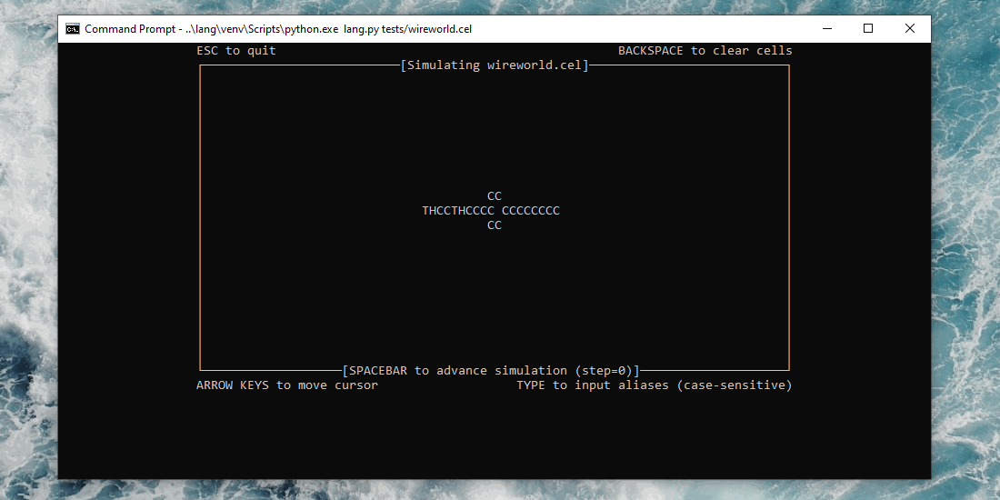

# The <sub>deerlang</sub> Language
This language allows users to define cellular automata and run them in an interactive shell.

# Examples
All examples are found in the `deerlang/tests/ directory`. The interesting examples are `life.cel` (Conway's Game of Life) and `wireworld.cel` (Wireworld).

## Conway's Game of Life
All cells start as being dead. Live cells are displayed by "L". A cell can be made live by typing "L". For a description of Conway's Game of Life, see https://en.wikipedia.org/wiki/Conway%27s_Game_of_Life.
```
Meta {
  Rows = 20
  Cols = 80
}

Cell {
  bool live = false
}

Aliases {
  L = { live = true }
}

Selectors {
  LiveCell = (live == true)
  DeadCell = !LiveCell

  LonelyCell = LiveCell & (MatchCount(neighbours, LiveCell) < 2)

  CrowdedCell = LiveCell & (MatchCount(neighbours, LiveCell) > 3)

  BabyCell = DeadCell & (MatchCount(neighbours, LiveCell) == 3)

  LonelyOrCrowded = LonelyCell | CrowdedCell
}

Rules {
  Death (LonelyOrCrowded) = {
    live = false
  }

  Birth (BabyCell) = {
    live = true
  }
}
```


## Wireworld
All cells start type 0 (no interaction). Conductors have alias "C". Electron heads have alias "H". Electron tails have alias "T". For a description of Wireworld, see https://en.wikipedia.org/wiki/Wireworld.


# Requirements
python 3.x

# Build Instructions
1. Navigate to the `deerlang` directory
2. Install dependencies (use of virtual environment is recommended): `pip install -r requirements.txt`
3. Run example: `python deerlang.py tests/life.cel`

# Components of a <sub>deerlang</sub> script
## Meta
Contains meta properties for simulation. Supports `"Rows"` and `"Cols"` properties. If not defined, default values are `Rows=20` and `Cols=80`.

Example:
```
Meta {
  Rows = 10
  Cols = 10  
}
```

## Cell
Defines the properties of each cell on the grid and their default values. Supports properties of type `int` or `bool`.

Example:
```
Cell {
  bool live = false
  int type = 1
}
```

## Aliases
Defines how cells are displayed in the UI and how the user can modify cells in the UI. Although not currently enforced, alias names should be a single letter. Note that letters `N`, `S`, `E`, and `W` are not allowed, since they are the available <sub>deers</sub>.

In the interactive UI, cells whose properties match that of an alias will be displayed with that alias' name. Typing an alias name on a cell will modify that cell's properties to match those defined by the alias.

Example:
```
Aliases {
  L = {
    live = true
  }
}
```

## Selectors
Defines boolean functions used to select cells based on their properties. Selectors are used to determine the transformation rules applied to each cell. Note that selectors support composition. Do not compose selectors in such a way that a circular reference is formed. We don't know what will happen but it will likely be bad. The built-in `MatchCount` function can be used to find the number of neighbouring cells matching the specified selector. The `MatchCount` function takes 2 arguments, the list of cells to check, and the selector to apply. The list of cells to check can either be the reserved word `neighbours` (meaning all 8 neighbours) or a list of cardinal directions, e.g. `[N, NW, SW, E]`.

Example:
```
Selectors {
  LiveCell = (live = true)
  DeadCell = !LiveCell
  BabyCell = DeadCell & (MatchCount(neighbours, LiveCell) == 3)
}
```

## Rules
Defines transformation rules for cells. Each rule has an associated selector. For each cell, the first defined rule whose selector matches the cell will be applied to determine the cell's next state.

Example:
```
Rules {
  Death (LiveCell) = {
    live = false
  }

  Birth (DeadCell) = {
    live = true
  }
}
```

# TUI
The text UI is perfect, has no bugs, and allows you to initialize and observe your simulation. You can move the cursor with arrow keys, enter aliases (case-sensitive) in the grid, and advance the simulation with spacebar. Press ESC to quit.

# FAQ
Q: Why is it called <sub>deerlang</sub>?
A: Because dir is a built-in function in python. Subscript because it is small.

Q: How does this involve patterns?
A: Selectors are a form of pattern matching. Additionally, well-behaved programs in <sub>deerlang</sub> tend to display patterns in their execution.
